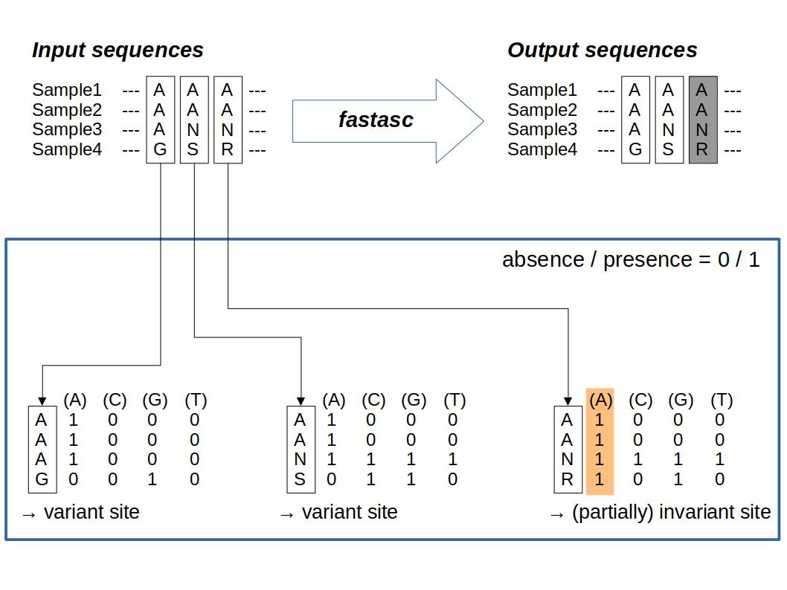

# fastasc
Remove completely/partially invariant sites from nucleotide aligned-FASTA for Lewis's ascertainment bias correction ( +ASC ).  


  

## Brief description
This is a simple Crystal-program and written under Crystal 1.17.1.   
This program takes aligned-FASTA as input and remove invariant sites for phylogenetic inference with Lewis's ASC methods.  
IUPAC nucleotide code in Upper/lower case and '?' can be accepted.  
Gap ('.' and '-'), 'N', 'n', and '?' are treated as _unknown_ (all 4 nucleotides are equally likely).  
 

* _Acceptable characters_
```
AaTtGgCcRrYySsWwKkMmBbDdHhVvNn-.?
```  


* _Example input_
```
cat ./test_data/test.fasta | awk 'NR%2==0{print $0}'
##ATGCatgccA
##ATGCatgccA
##ATGCatgcc.
##AAAYwnacy?
##ATR-wygyyT
```
  

* _Example output_
```
fastasc -f ./test_data/test.fasta | awk 'NR%2==0{print $0}'
##TGgA
##TGgA
##TGg.
##AAa?
##TRgT
```

Treating Whole-Genome SNP data can consume RAM.  
On my PC, processing an aligned-FASTA with 28 sequences with 37 Mb length took about 5.7 GB of RAM and 50 seconds in real time.  


## Installation

Go to `fastasc` directory and type:

```
mkdir ./bin && crystal build --release -o ./bin/ ./src/fastasc.cr
```
This will compile the source code to an executable binary file (`./bin/fastasc`).  
Crystal language can be easily installed by following [Crystal Docs](https://crystal-lang.org/install/).


## Usage

```
Usage: fastasc -f INPUT.fa > OUTPUT.fa
        or
       cat INPUT.fa | fastasc -f - > OUTPUT.fa

Remove completely/partially invariant sites from nucleotide aligned fasta for +ASC subst model
    -v, --version                    Show version
    -h, --help                       Show this help message
    -f fasta, --fasta=fasta          Path to input aligned fasta. Set '-' for STDIN.
```


## Input format
`fastasc` takes aligned-FASTA as input.  
Outputs of `mafft`, `vcf2phylip.py`, and `vcf2alnfasta` can be accepted.

